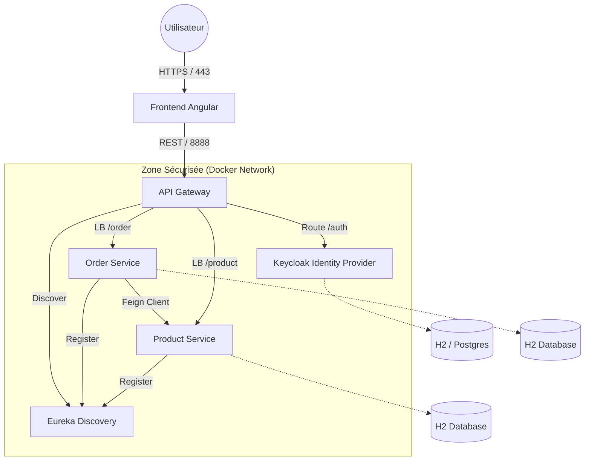

# E-Commerce Microservices Architecture (Secured with Keycloak)

Ce projet est une plateforme e-commerce complète basée sur une architecture microservices, sécurisée par **Keycloak** (OAuth2/OIDC) et disposant d'un frontend moderne en **Angular**.

L'ensemble de la plateforme est conteneurisée avec **Docker** pour un déploiement simplifié.

## Architecture Globale

Le système repose sur une communication centralisée via une API Gateway, avec une découverte de services dynamique (Eureka).



### Vue d'ensemble Virtualisation


## Fonctionnalités Clés & Démonstration

### 1. Infrastructure & Sécurité

**Service Discovery (Eureka)**
Tous les microservices s'enregistrent dynamiquement auprès d'Eureka.


**Gateway & Routing**
L'API Gateway centralise les requêtes. Ici un test d'accès aux produits via la Gateway.


**Authentification Keycloak**
Gestion des utilisateurs et des rôles (ADMIN, USER) via Keycloak.


### 2. Gestion des Produits (Product-Service)

**API REST Produits**
- Récupération de tous les produits :
  
- Consultation d'un produit spécifique :
  

**Persistance H2**
Vue de la base de données H2 pour les produits.


**Sécurité (RBAC)**
Un utilisateur simple ne peut pas ajouter de produit (403 Forbidden).


### 3. Gestion des Commandes (Order-Service)

**API REST Commandes**
- Création et consultation des commandes :
  
- Mise à jour (ex: Statut) :
  
- Suppression :
  

**Persistance H2**
Vue de la base de données H2 pour les commandes.


---

## Pré-requis

- **Docker** & Docker Compose
- **Java 21** (si exécution locale)
- **Node.js 22** (si exécution locale)

## Installation et Démarrage (Docker)

1. **Cloner le projet**
   ```bash
   git clone https://github.com/votre-repo/tp4-security.git
   cd tp4-security
   ```

2. **Lancer la stack**
   ```bash
   docker-compose up --build
   ```

3. **Accéder à l'application**
   - Frontend : [http://localhost:4200](http://localhost:4200)
   - Keycloak Console : [http://localhost:8080](http://localhost:8080)
   - Eureka Dashboard : [http://localhost:8761](http://localhost:8761)
